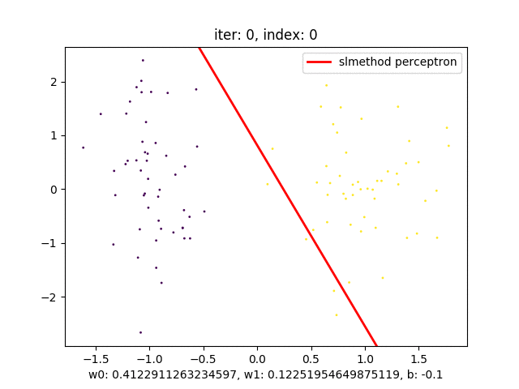
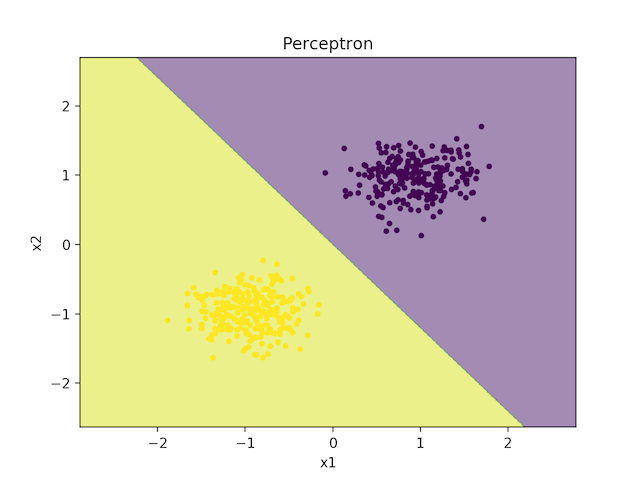
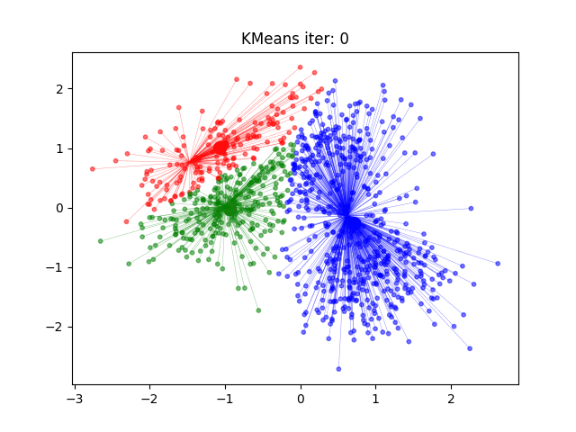
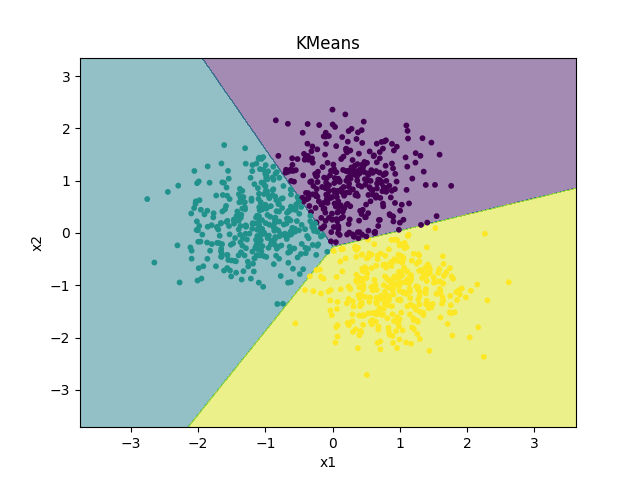

# slmethod

[](https://travis-ci.org/iOSDevLog/slmethod)


[](https://twitter.com/intent/tweet?text=Wow:&url=https%3A%2F%2Fgithub.com%2FiOSDevLog%2Fslmethod)

Statistical Learning Method 统计学习方法

GitHub: <https://github.com/iOSDevLog/slmethod>

## 方法

- [x] precentron
- [x] kmeans

## 截图

### 感知机 Perceptron





### KMeans





## PyPI 源加速

```python
pip install -i https://pypi.tuna.tsinghua.edu.cn/simple slmethod
```

## 代码规范

参考：<https://docs.python.org/3/tutorial>

### .vscode/settings.json

```json
{
  "python.pythonPath": "/Users/iosdevlog/.Envs/slmethod/bin/python",
  "python.linting.flake8Enabled": true,
  "python.formatting.provider": "yapf",
  "python.linting.flake8Args": ["--max-line-length=248"],
  "python.linting.pylintEnabled": false
}
```

- 字符串使用双引号： **""**

## 安装

```sh
pip install slmethod
```

## 开发

### 本地开发

```sh
pip3 install -e .
```

### 测试

```sh
pytest slmethod
```

### 发布

```sh
python3 setup.py sdist bdist_wheel
twine upload dist/*
```

## License

slmethod is released under the MIT license. See [LICENSE](LICENSE) for details.
